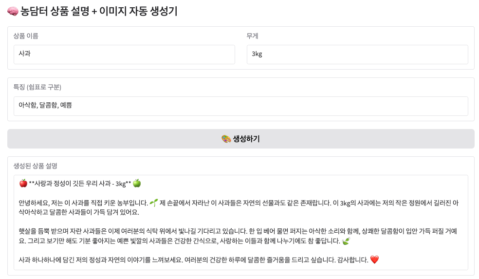
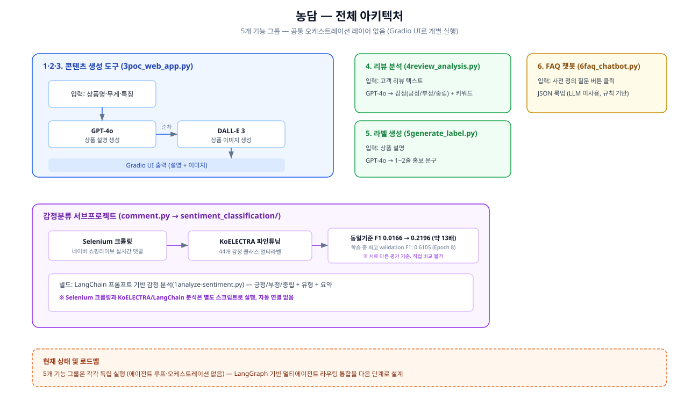

# 🌾 농담 (농업 라이브 쇼핑 AI)

> 고령의 농업인들을 위한 **멀티모달 생성형 AI 시스템**
> 텍스트 입력만으로 상품 설명과 이미지를 자동 생성하는 5개 Agent 파이프라인

## 📸 프로젝트 데모




---

## 📋 프로젝트 개요

### 배경
- 고령의 농업인들이 텍스트와 이미지를 직접 제작하기 어려움
- 농산물 홍보 문구 작성 및 상품 이미지 생성 자동화 필요

### 목표
- 텍스트 입력만으로 **이미지 + 설명 자동 생성**
- 멀티모달 생성형 AI 파이프라인 구현
- CS 업무 자동화 (FAQ, 리뷰 분석)

---

## ✨ 주요 기능

### 1️⃣ 이미지 생성 Agent
- **DALL·E 3 API**를 활용한 텍스트 기반 이미지 자동 생성
- 자연광 아래 촬영된 것처럼 현실적인 상품 사진 생성

### 2️⃣ 텍스트 생성 Agent
- **GPT-4o** 프롬프트 엔지니어링
- 농부의 따뜻하고 신뢰감 있는 말투로 상품 설명 작성

### 3️⃣ 리뷰 분석 Agent
- 감성 분석으로 사용자 피드백 요약
- 긍정/부정/중립 자동 분류 및 키워드 추출

### 4️⃣ 라벨 생성 Agent
- 제품 설명 기반 홍보 문구 자동 생성
- 1~2줄 감성 문구 생성

### 5️⃣ FAQ 챗봇 Agent
- 사전 정의된 JSON 기반 규칙형 챗봇
- 배송, 교환, 반품, 못난이 상품 관련 문의 자동 응답

---

## 🏗️ 프로젝트 구조

<div align="center">
  
</div>

```
농담/
│
├── 1generate_description.py  # 상품 설명 자동 생성
├── 2generate_image.py         # DALL·E 3 이미지 생성
├── 3poc_web_app.py            # Gradio UI 통합
├── 4review_analysis.py        # 리뷰 감정 분석
├── 5generate_label.py         # 라벨 문구 생성
├── 6faq_chatbot.py            # FAQ 자동 응답
├── faq_data.json              # FAQ 데이터
│
├── 감정분류/                   # 감정 분석 프로젝트
│   ├── comment.py             # Selenium 댓글 수집
│   ├── 1analyze-sentiment.py # LangChain 감정 분석
│   ├── sentiment_classification/
│   │   └── train.ipynb        # KoELECTRA 파인튜닝
│   ├── sentiment_plot.png     # 감정별 분포
│   └── type_plot.png          # 유형별 분포
│
├── 서류/                       # 지원 서류
│   ├── 사각_채용공고서.txt
│   ├── 사각_포트폴리오.md
│   ├── 열매컴퍼니_채용공고.txt
│   └── 열매컴퍼니_포트폴리오.md
│
├── .gitignore
└── README.md
```

---

## 🚀 실행 방법

### 환경 설정

```bash
# 1. 가상환경 생성 및 활성화
python -m venv .venv
source .venv/bin/activate  # Windows: .venv\Scripts\activate

# 2. 패키지 설치 (모든 의존성 포함)
pip install -r requirements.txt

# 3. 환경 변수 설정
cp .env.example .env
# .env 파일을 열어서 OPENAI_API_KEY를 실제 API 키로 변경하세요
# OPENAI_API_KEY=your_actual_api_key_here
```

### 개별 Agent 실행

```bash
# 상품 설명 생성
python 1generate_description.py

# 이미지 생성
python 2generate_image.py

# 리뷰 분석
python 4review_analysis.py

# 라벨 생성
python 5generate_label.py

# FAQ 챗봇
python 6faq_chatbot.py
```

### Gradio 통합 UI 실행

```bash
python 3poc_web_app.py
```

브라우저에서 `http://localhost:7860` 접속

---

## 🧠 감정분류 프로젝트

### KoELECTRA 파인튜닝

```bash
cd 감정분류/sentiment_classification

# Jupyter Notebook에서 train.ipynb 실행
# 또는 Google Colab에서 실행
```

### 주요 성능
- **모델**: KoELECTRA (snunlp/KR-ELECTRA-discriminator)
- **Task**: 44개 감정 클래스 멀티라벨 분류
- **성능**: 학습 중 최고 validation F1 Score 0.6105 (Epoch 8, multi-label threshold 기준)
- **개선도**: 동일 평가 기준(test set, single-label) 사전학습 모델 F1 0.0166 → 파인튜닝 후 0.2196 *(약 13배 향상)*

### 학습 설정
```python
BATCH_SIZE = 16
EPOCHS = 10
LEARNING_RATE = 2e-5
PATIENCE = 3  # Early Stopping
```

### 댓글 수집 (Selenium)

```bash
python comment.py
```

네이버 쇼핑라이브 실시간 댓글 수집

### 감정 분석 (LangChain)

```bash
python 1analyze-sentiment.py
```

LangChain 프롬프트 기반 감정 분석 (긍정/부정/중립 + 유형 + 요약)

---

## 🛠️ 기술 스택

### AI/ML
- **OpenAI API**: GPT-4o, DALL·E 3
- **LangChain**: 프롬프트 엔지니어링
- **PyTorch**: 모델 학습
- **HuggingFace Transformers**: KoELECTRA 파인튜닝

### 데이터 처리
- **Pandas**: 데이터 전처리
- **Selenium**: 웹 크롤링

### UI/UX
- **Gradio**: 웹 인터페이스

### 개발 환경
- **Python 3.8+**
- **Jupyter Notebook**

---

## 📊 프로젝트 성과

### ✅ 농담 프로젝트
- 텍스트 입력만으로 **이미지 + 설명 자동 생성** 성공
- Gradio UI 기반 실시간 결과 확인 가능
- **모듈형 구조**로 설계된 5개 Agent 파이프라인
- CS 업무 자동화로 **운영 효율 향상 및 비용 절감** 기대

### ✅ 감정분류 프로젝트
- KoELECTRA 44개 감정 클래스 파인튜닝, 학습 중 최고 validation F1 Score 0.61 달성
- 동일 평가 기준 사전학습 모델 대비 **약 13배 성능 향상** (F1 0.0166 → 0.2196)
- Early Stopping, Learning Rate 튜닝 적용
- 감정별 분포 시각화 완료

---

## 🎯 향후 계획

### 농담 프로젝트
- [ ] LangGraph 기반 통합 워크플로 구축
- [ ] 5개 Agent를 동적으로 라우팅하는 Multi-Agent System 구현
- [ ] FastAPI로 API 엔드포인트화
- [ ] Docker 컨테이너 배포

### 감정분류 프로젝트
- [ ] Vision AI 추가 (이미지 기반 감정 분석)
- [ ] 실시간 스트리밍 댓글 분석
- [ ] MLOps 파이프라인 구축 (Docker, K8s)

---

## 🏢 프로젝트 적용 가능 분야

### 열매컴퍼니 (미술품 투자 플랫폼)
- **DALL·E 3** → 미술품 이미지 자동 생성 및 분석
- **KoELECTRA 파인튜닝** → 투자자 리뷰 감정 분석
- **Vision AI** → 작품 특징(화풍, 색감, 구도) 자동 추출
- **GPT-4o** → 작품 설명 자동 생성

### 사각 (헬스케어 AI 에이전트)
- **멀티모달 AI** → 텍스트 + 이미지 + 음성 통합
- **Multi-Agent 확장** → 의료 데이터 자동 분석
- **프롬프트 엔지니어링** → 환자 맞춤형 응답

---

## 📝 라이선스

이 프로젝트는 개인 포트폴리오 목적으로 제작되었습니다.

---

## 👨‍💻 개발자

**Daniel_Shin**
- 📧 Email: codingiswine@gmail.com
- 💻 GitHub: https://github.com/codingiswine

---

## 🙏 감사의 말

- OpenAI API를 활용한 멀티모달 생성형 AI 경험
- HuggingFace Transformers를 활용한 LLM 파인튜닝 경험
- LangChain을 활용한 프롬프트 엔지니어링 경험

이 프로젝트를 통해 **멀티모달 AI의 실무 활용 능력**을 습득했습니다.
