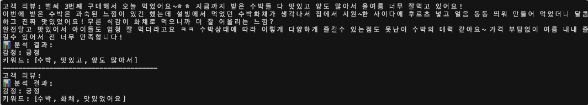

# 🎭 감정분류 프로젝트

> KoELECTRA 기반 한국어 감정 분석 시스템
> 44개 감정 클래스 멀티라벨 분류 파인튜닝

## 📸 프로젝트 데모



---

## ⚠️ 데이터 저작권 관련 안내

### 📋 데이터 출처 및 사용 목적

본 프로젝트에서 사용된 데이터는 다음과 같습니다:

#### 1. KOTE 데이터셋 (Korean Opinion and Emotion Dataset)
- **출처**: AI Hub 한국어 감정 정보가 포함된 단발성 대화 데이터셋
- **라이선스**: AI Hub 공개 데이터셋 이용약관 준수
- **사용 목적**: 학습 및 연구 목적 (포트폴리오)
- **포함 데이터**: `train.tsv`, `test.tsv`, `val.tsv` (총 50,000개 샘플)

#### 2. 댓글 데이터 (comments.csv)
- **출처**: 네이버 쇼핑라이브 공개 댓글
- **사용 목적**: 실습 및 PoC (Proof of Concept)
- **개인정보 처리**: 모든 개인 식별 정보 제거됨
- **상태**: **예시 데이터로만 사용** (상업적 사용 불가)

#### 3. 학습된 모델 가중치
- **베이스 모델**: snunlp/KR-ELECTRA-discriminator (MIT License)
- **파인튜닝 모델**: 본 프로젝트에서 학습 (비공개)
- **재배포**: 불가 (포트폴리오 목적으로만 사용)

---

## 🔒 데이터 사용 제한 사항

### ✅ 허용 사항
- 학습 및 연구 목적 사용
- 포트폴리오 및 면접 목적 공개
- 코드 및 학습 방법론 공개

### ❌ 금지 사항
- 상업적 사용
- 데이터 재배포
- 학습된 모델 가중치 공개 배포
- 개인정보가 포함된 원본 데이터 공개

---

## 📊 프로젝트 개요

### 목표
- 44개 감정 클래스 멀티라벨 분류
- KoELECTRA 기반 한국어 감정 분석 모델 파인튜닝
- 네이버 쇼핑라이브 실시간 댓글 감정 분석

### 성능
- **F1 Score**: 0.6105 (Epoch 8)
- **개선도**: 사전학습 모델 (0.0166) → 파인튜닝 후 (0.6105) *약 36배 향상*

---

## 🏗️ 프로젝트 구조

```
감정분류/
├── comment.py             # Selenium 댓글 수집
├── 1analyze-sentiment.py # LangChain 감정 분석
├── 2analyze-sentiment-graph.py   # 감정 분포 시각화
├── test.py                       # CSV 파일 검증 스크립트
│
├── sentiment_classification/     # KoELECTRA 파인튜닝
│   ├── train.ipynb              # 학습 노트북 (Google Colab)
│   ├── config.json              # 모델 설정
│   ├── tokenizer_config.json    # 토크나이저 설정
│   ├── special_tokens_map.json  # 특수 토큰
│   ├── tokenizer.json           # 토크나이저
│   ├── vocab.txt                # 어휘 사전
│   └── train_log.csv            # 학습 로그 (epoch, loss, f1)
│
├── sentiment_plot.png            # 감정별 분포 (시각화 결과)
├── type_plot.png                 # 유형별 분포 (시각화 결과)
└── README.md
```

**📁 사용자가 직접 생성하는 파일:**
- `comments.csv` - comment.py 실행 시 생성 (개인정보 보호로 저장소 제외)
- `live_comments_result.csv` - 1analyze-sentiment.py 실행 시 생성
- `chromedriver` - 시스템 PATH에 설치 (brew install chromedriver 권장)

**📁 학습 데이터 (저장소 제외):**
- `train.tsv`, `val.tsv`, `test.tsv` - AI Hub에서 다운로드 필요
- KoELECTRA 파인튜닝 재현 시에만 필요

---

## 🚀 실행 방법

### 1. 환경 설정

```bash
# 프로젝트 루트에서 패키지 설치 (모든 의존성 포함)
cd ..
pip install -r requirements.txt

# ChromeDriver 설치 (Selenium용 - comment.py 실행 시 필요)
# macOS: brew install chromedriver
# 또는 https://chromedriver.chromium.org/ 에서 다운로드
```

### 2. 댓글 수집

```bash
# ChromeDriver 설치 확인 (PATH에 있어야 함)
which chromedriver  # macOS/Linux
# 없다면: brew install chromedriver

# 댓글 수집 실행
python comment.py

# 생성된 파일: comments_YYYYMMDD_HHMMSS.csv
# 예: comments_20250116_140530.csv
```

**CSV 파일 형식:**
```csv
comment,timestamp
"좋아요!",2025-01-16 14:05:30
"배송 빠르네요",2025-01-16 14:05:32
```

**⚠️ 주의**:
- ChromeDriver는 시스템 PATH에 설치되어 있어야 합니다
- 실제 서비스 댓글 수집 시 해당 플랫폼의 이용약관을 준수해야 합니다
- 저장소에는 개인정보 보호를 위해 CSV 파일이 포함되지 않습니다

### 3. 감정 분석 (LangChain)

```bash
# 프로젝트 루트에 .env 파일 생성 및 OpenAI API 키 설정
cd ..
cp .env.example .env
# .env 파일에 OPENAI_API_KEY 입력

# 감정 분석 실행
cd 감정분류

# 방법 1: 기본 파일명 사용 (comments.csv로 저장한 경우)
python 1analyze-sentiment.py

# 방법 2: 특정 CSV 파일 지정
python 1analyze-sentiment.py --input comments_20250116_140530.csv

# 출력: live_comments_result.csv (분석 결과)
```

**필수 조건:**
- OpenAI API 키가 `.env` 파일에 설정되어 있어야 함
- `comments.csv` 또는 `--input`으로 지정한 CSV 파일이 존재해야 함

### 4. KoELECTRA 파인튜닝

```bash
cd sentiment_classification

# Google Colab에서 train.ipynb 실행
# 또는 Jupyter Notebook에서 실행
jupyter notebook train.ipynb
```

### 5. 감정 분포 시각화

```bash
# 감정 분석 결과가 있어야 함 (live_comments_result.csv)
python 2analyze-sentiment-graph.py

# 출력:
# - sentiment_plot.png (감정별 분포)
# - type_plot.png (유형별 분포)
```

**필수 조건:**
- `1analyze-sentiment.py` 실행 후 생성된 `live_comments_result.csv` 필요

---

## 🧠 모델 아키텍처

### KoELECTRA 파인튜닝

```python
# 베이스 모델
model_name = "snunlp/KR-ELECTRA-discriminator"

# 하이퍼파라미터
BATCH_SIZE = 16
EPOCHS = 10
LEARNING_RATE = 2e-5
PATIENCE = 3  # Early Stopping
NUM_LABELS = 44  # 멀티라벨 분류
MAX_LENGTH = 128

# 손실 함수
criterion = torch.nn.BCEWithLogitsLoss()

# 옵티마이저
optimizer = torch.optim.AdamW(model.parameters(), lr=LEARNING_RATE)
```

### 학습 과정

1. **데이터 로드**: KOTE 데이터셋 (train: 40,000 / val: 5,000 / test: 5,000)
2. **토큰화**: KoELECTRA 토크나이저 (Max Length: 128)
3. **학습**: 10 Epochs (Early Stopping)
4. **평가**: F1 Score (Micro Averaging)

### 학습 결과

| Epoch | Train Loss | Val F1 Score |
|-------|-----------|--------------|
| 1 | 0.3406 | 0.4873 |
| 2 | 0.2852 | 0.5428 |
| 3 | 0.2642 | 0.5812 |
| 5 | 0.2335 | 0.5837 |
| 6 | 0.2191 | 0.6022 |
| 7 | 0.2055 | 0.6055 |
| **8** | **0.1932** | **0.6105** ⭐ |

**Best Model: Epoch 8 (F1 Score: 0.6105)**

---

## 📊 감정 분류 체계

### 44개 감정 클래스

감정은 다음 3가지 그룹으로 분류됩니다:

#### 🟢 긍정 감정 (12개)
- 기쁨, 사랑, 감동, 기대, 만족, 신뢰, 편안함, 자신감, 흥미, 활력, 감사, 희망

#### 🔴 부정 감정 (16개)
- 분노, 슬픔, 불안, 좌절, 두려움, 혐오, 질투, 창피, 후회, 실망, 짜증, 우울, 스트레스, 무력감, 죄책감, 고통

#### ⚪ 중립 감정 (16개)
- 놀람, 의심, 혼란, 무관심, 외로움, 그리움, 피곤, 지루함, 평온, 호기심, 긴장, 안도, 공감, 부끄러움, 당황, 동정

---

## 🎯 활용 방안

### 1. 미술품 투자 플랫폼 (열매컴퍼니)
- **투자자 리뷰 감정 분석**: 긍정·부정·중립 자동 분류
- **시장 심리 지표 생성**: 투자 트렌드 파악
- **작품 평가 자동화**: 리뷰 기반 작품 평점 산출

### 2. 전자상거래 플랫폼
- **상품 리뷰 자동 분석**: CS 업무 자동화
- **고객 만족도 모니터링**: 실시간 감정 추적
- **위기 상황 조기 감지**: 부정 감정 급증 알림

### 3. 소셜 미디어 모니터링
- **브랜드 평판 관리**: 실시간 여론 분석
- **인플루언서 마케팅**: 댓글 반응 분석
- **위기 관리**: 부정 여론 조기 감지

---

## 🛠️ 기술 스택

### ML/DL
- **PyTorch**: 1.13.0+
- **Transformers**: 4.40.2
- **HuggingFace**: Tokenizer, Trainer

### 데이터 처리
- **Pandas**: 데이터 전처리
- **NumPy**: 수치 연산
- **Scikit-learn**: F1 Score 평가

### 웹 크롤링
- **Selenium**: 실시간 댓글 수집

### 프롬프트 AI
- **LangChain**: 프롬프트 기반 감정 분석
- **OpenAI API**: GPT-4o

### 시각화
- **Matplotlib**: 감정 분포 그래프

---

## 📈 성능 비교

| 모델 | F1 Score (Micro) | 비고 |
|-----|-----------------|------|
| snunlp/KR-ELECTRA (사전학습) | 0.0166 | 베이스라인 |
| **파인튜닝 모델 (Epoch 8)** | **0.6105** | **약 36배 향상** ⭐ |

---

## 🔮 향후 계획

- [ ] Vision AI 추가 (이미지 기반 감정 분석)
- [ ] 실시간 스트리밍 댓글 분석 시스템
- [ ] MLOps 파이프라인 구축 (Docker, K8s, MLflow)
- [ ] FastAPI 기반 REST API 서버 구축
- [ ] React 기반 대시보드 개발

---

## 📝 라이선스 및 저작권

### 코드
- **라이선스**: MIT License (본 프로젝트 코드)
- **재사용**: 자유롭게 사용 가능 (출처 표기 권장)

### 데이터
- **KOTE 데이터셋**: AI Hub 이용약관 준수
- **댓글 데이터**: 예시 데이터로만 사용 (상업적 사용 불가)
- **재배포 금지**: 원본 데이터 재배포 불가

### 모델
- **베이스 모델**: snunlp/KR-ELECTRA-discriminator (MIT License)
- **파인튜닝 모델**: 비공개 (포트폴리오 목적으로만 사용)

**⚠️ 중요**: 본 프로젝트는 **학습 및 포트폴리오 목적**으로만 제작되었으며, 상업적 사용을 목적으로 하지 않습니다.

---

## 👨‍💻 개발자

**Daniel_Shin**
- 📧 Email: codingiswine@gmail.com
- 💻 GitHub: https://github.com/codingiswine

---

## 🙏 참고 자료

- **KoELECTRA**: [https://github.com/snunlp/KR-ELECTRA](https://github.com/snunlp/KR-ELECTRA)
- **KOTE Dataset**: AI Hub 한국어 감정 정보가 포함된 단발성 대화 데이터셋
- **HuggingFace Transformers**: [https://huggingface.co/docs/transformers](https://huggingface.co/docs/transformers)
- **PyTorch**: [https://pytorch.org/](https://pytorch.org/)
